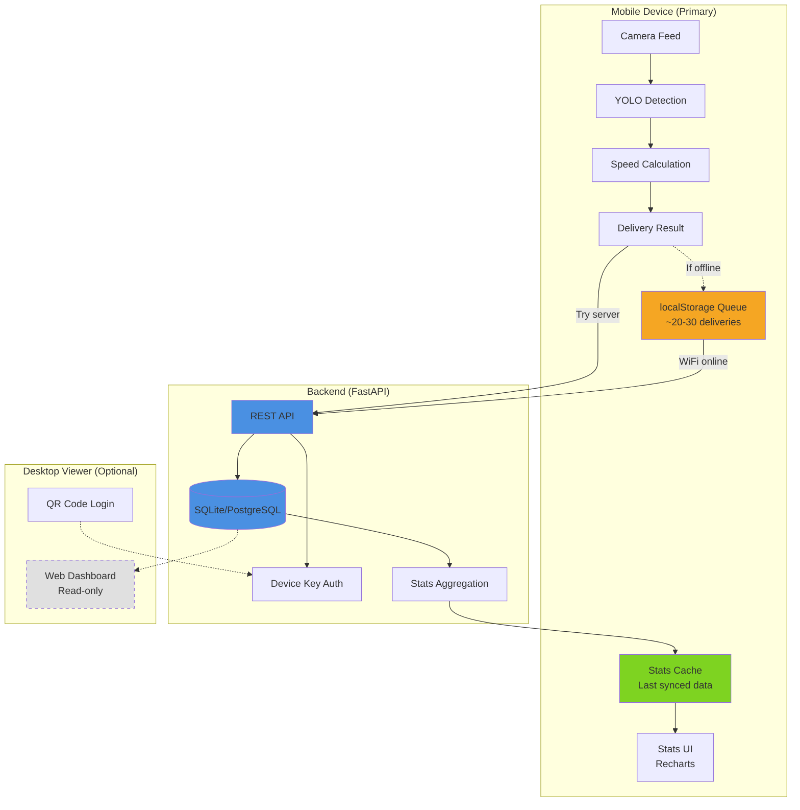

# Player Stats Architecture

**Epic 4: Player Statistics & Progress**  
**Status:** Planning / Revised for Mobile-First  
**Architecture:** Server-side DB with localStorage queue  
**Confidence:** 95% ✅

---

## 🏗️ Architecture Diagram (Mobile-First)



---

## 📊 Data Model

### PlayerProfile

```typescript
interface PlayerProfile {
  id: string; // UUID
  name: string; // "Vikram", "Player 1"
  createdAt: Date;
  updatedAt: Date;
  avatar?: string; // Base64 or URL
  preferences: {
    defaultPitchLength: number; // meters
    defaultBallWeight: number; // grams
  };
}
```

### DeliveryRecord

```typescript
interface DeliveryRecord {
  id: string; // UUID
  playerId: string; // FK to PlayerProfile
  sessionId: string; // Groups deliveries in one practice
  timestamp: Date;

  // Calibration used
  pitchLength: number; // meters
  ballWeight: number; // grams

  // Results
  speed: number; // km/h
  confidence: number; // 0-1

  // Trajectory data (optional, for replay)
  trajectoryPoints?: TrajectoryPoint[];
  bouncePoint?: { x: number; y: number };
  length?: "full" | "good" | "short";
  line?: string;

  // Metadata
  deviceInfo?: string;
  cameraFPS?: number;
  warnings?: string[];
}
```

### Session

```typescript
interface Session {
  id: string; // UUID
  playerId: string;
  startTime: Date;
  endTime?: Date;
  deliveryCount: number;
  averageSpeed: number;
  notes?: string;
  location?: string; // "Home nets", "Cricket ground"
}
```

### Aggregates (Computed)

```typescript
interface PlayerStats {
  playerId: string;

  // Overall
  totalDeliveries: number;
  averageSpeed: number;
  maxSpeed: number;
  minSpeed: number;

  // Distributions
  speedDistribution: { bucket: string; count: number }[]; // "130-135", "135-140"
  lengthDistribution: { length: string; count: number }[];

  // Trends (last N sessions)
  recentSessions: SessionSummary[];
  speedTrend: { date: Date; avgSpeed: number }[];

  // Personal bests
  personalBest: DeliveryRecord;
  topDeliveries: DeliveryRecord[]; // Top 10
}
```

---

## 🔄 Data Flow

### 1. Recording & Saving a Delivery

```
User records delivery
  ↓
Analysis completes with result
  ↓
UI shows "Save to Profile?" prompt
  ↓
User clicks "Save"
  ↓
usePlayerStats.saveDelivery(result)
  ↓
IndexedDB stores record
  ↓
[Optional] Sync to backend if enabled
  ↓
Stats UI updates reactively
```

### 2. Viewing Stats

```
User opens Stats tab
  ↓
usePlayerStats.getStats(playerId, filters)
  ↓
Query IndexedDB with filters
  ↓
Compute aggregates (avg, max, distribution)
  ↓
Render charts and tables
```

### 3. Optional Cloud Sync

```
User enables sync in settings
  ↓
Generate device key (stored in localStorage)
  ↓
Background sync on wifi:
  - Push new deliveries to backend
  - Pull deliveries from other devices
  - Resolve conflicts (last-write-wins)
```

---

## 🗄️ Storage Strategy

### IndexedDB Schema (idb library)

```typescript
// Database: speedometer-db
// Version: 1

// Object Store: profiles
{
  keyPath: 'id',
  indexes: {
    'name': { unique: false }
  }
}

// Object Store: deliveries
{
  keyPath: 'id',
  indexes: {
    'playerId': { unique: false },
    'sessionId': { unique: false },
    'timestamp': { unique: false },
    'playerId+timestamp': { unique: false, compound: true }
  }
}

// Object Store: sessions
{
  keyPath: 'id',
  indexes: {
    'playerId': { unique: false },
    'startTime': { unique: false }
  }
}
```

### localStorage (Settings)

```typescript
{
  'speedometer:sync:enabled': boolean,
  'speedometer:sync:deviceKey': string,
  'speedometer:activeProfileId': string,
  'speedometer:privacy:telemetry': boolean
}
```

---

## 🔐 Privacy & Security

### Principles

1. **Local-First**: All data stays on device by default
2. **Explicit Opt-In**: Cloud sync requires user action
3. **No PII Required**: Device key only, no email/password
4. **Export/Import**: User owns their data (CSV/JSON)
5. **Clear Data**: Easy purge button in settings

### Device Key Auth (Optional Backend)

```typescript
// Frontend generates on first sync enable
const deviceKey = crypto.randomUUID();
localStorage.setItem('speedometer:sync:deviceKey', deviceKey);

// Backend validates
POST /api/deliveries
Headers:
  X-Device-Key: <uuid>

// Backend associates deliveries with device key
// Multiple devices = multiple keys = separate data streams
// User can "link devices" by sharing key manually (QR code)
```

---

## 🎨 UI Components (Tasks)

### T12: Data Model & Storage

- IndexedDB setup with idb
- CRUD operations for profiles/deliveries/sessions
- Migration strategy for schema changes

### T13: Backend API (Optional)

- FastAPI endpoints: POST /deliveries, GET /stats
- Device key auth middleware
- SQLite persistence
- Conflict resolution (last-write-wins)

### T14: Frontend Dashboards

- Stats overview page (cards: avg speed, max, total deliveries)
- Speed trend chart (line chart, last 30 days)
- Distribution histogram (speed buckets)
- Session history table (sortable, filterable)
- Filters: date range, pitch length, ball weight

### T15: Privacy & Export

- Settings UI: enable/disable sync, clear data
- Export button: download CSV or JSON
- Import: upload previously exported data
- Privacy policy snippet (inline doc)

---

## 📈 Performance Considerations

### IndexedDB Queries

- **Deliveries per profile**: ~100-500 typical, 5000 max
- **Query time**: <50ms for aggregates with indexes
- **Memory**: ~1MB per 1000 deliveries (with trajectories)

### Chart Rendering

- **Data points**: Limit to last 100 sessions for line charts
- **Histogram buckets**: 10-15 buckets max
- **Lazy load**: Paginate session history (20 per page)

### Sync Strategy

- **Debounce**: Sync every 60s when new deliveries added
- **Wifi-only**: Check `navigator.connection.effectiveType`
- **Background**: Use `requestIdleCallback` to avoid blocking UI

---

## 🚀 Implementation Phases

### Phase 1: Local-Only (T12 + T14)

- ✅ No backend required
- ✅ Works offline
- ✅ Privacy-first
- ✅ Fast time-to-value

### Phase 2: Optional Sync (T13 + T15)

- 🔧 Backend for multi-device users
- 🔧 Device key auth
- 🔧 Export/import

### Phase 3: Advanced Features (Future)

- 🔮 Compare with other players (opt-in leaderboard)
- 🔮 Coaching insights (AI-powered suggestions)
- 🔮 Session templates (warmup, match prep, etc.)

---

## 🎯 Key Architecture Decisions

### 1. **Mobile-First, Not Multi-Device**

**Rationale:** Laptops don't have good cameras for ball tracking → 95% of usage is mobile recording.

**Implications:**

- ✅ Primary use case: Record + view on same mobile device
- ✅ localStorage queue is perfect (no complex sync)
- ✅ Desktop viewer is optional, read-only (Phase 2)
- ✅ No IndexedDB needed (localStorage sufficient for queue)

### 2. Profile Management

**Decision:** Single implicit profile for MVP

**Rationale:**

- Individual users (primary audience) don't need profile switching
- Can add multi-profile later for coaches if demand exists
- Simpler onboarding

**Implementation:**

- Device key = player identifier
- Profile name stored in localStorage (editable in settings)

### 3. Session Auto-Detection

**Decision:** Manual "Start/End Session" with auto-close

**Rationale:**

- More predictable than time-gap heuristics
- User controls session boundaries
- Auto-close after 1 hour prevents forgotten sessions

**Implementation:**

- "Start Practice" button creates new session
- All deliveries link to active session
- "End Practice" or 1-hour timeout closes session

### 4. Offline Queue Strategy

**Decision:** localStorage queue with Background Sync API

**Rationale:**

- 20-30 deliveries = ~21 KB (tiny for localStorage)
- Fast read/write (<5ms)
- Simple API (synchronous)
- Works in all browsers

**Implementation:**

- Queue in localStorage as JSON array
- Sync on `online` event + app open
- Background Sync API for Chrome/Edge (progressive enhancement)
- Retry with exponential backoff (max 3 attempts)

### 5. Chart Library

**Decision:** Recharts

**Rationale:**

- React-native (declarative, familiar API)
- Small bundle (20KB gzipped)
- Good accessibility support
- Active maintenance

**Alternatives considered:**

- Chart.js (60KB, imperative - rejected)
- D3 (powerful but overkill - rejected)
- Custom SVG (lightest but high dev time - defer)

---

## 📊 Effort Estimate (Revised)

### Phase 1: Mobile MVP (2-3 days)

- T12: Backend schema + API (1 day)
- T13: Device key auth + stats aggregation (0.5 day)
- T14: Frontend stats UI + charts (1 day)
- T15: Offline queue + sync indicator (0.5 day)

### Phase 2: Desktop Viewer (Optional, 1 day)

- QR code login
- Desktop-optimized charts
- Export enhancements

**Total MVP**: 2-3 days ✅

---

## ✅ Implementation Checklist

- [ ] Update project-plan.json with revised T12-T15 tasks
- [ ] Update Gantt chart in project-plan.md
- [ ] Create GitHub issues for Player Stats epic
- [ ] Backend: SQLite schema + FastAPI endpoints
- [ ] Frontend: localStorage queue utilities
- [ ] Frontend: Stats UI components + Recharts integration
- [ ] PWA: Service Worker + Background Sync
- [ ] Testing: Offline queue, sync retry, stats aggregation

---

**Created:** 2025-10-27  
**Last Updated:** 2025-10-27  
**Authors:** Copilot + Vik  
**Status:** ✅ Finalized - Mobile-First Architecture  
**Confidence:** 95%
