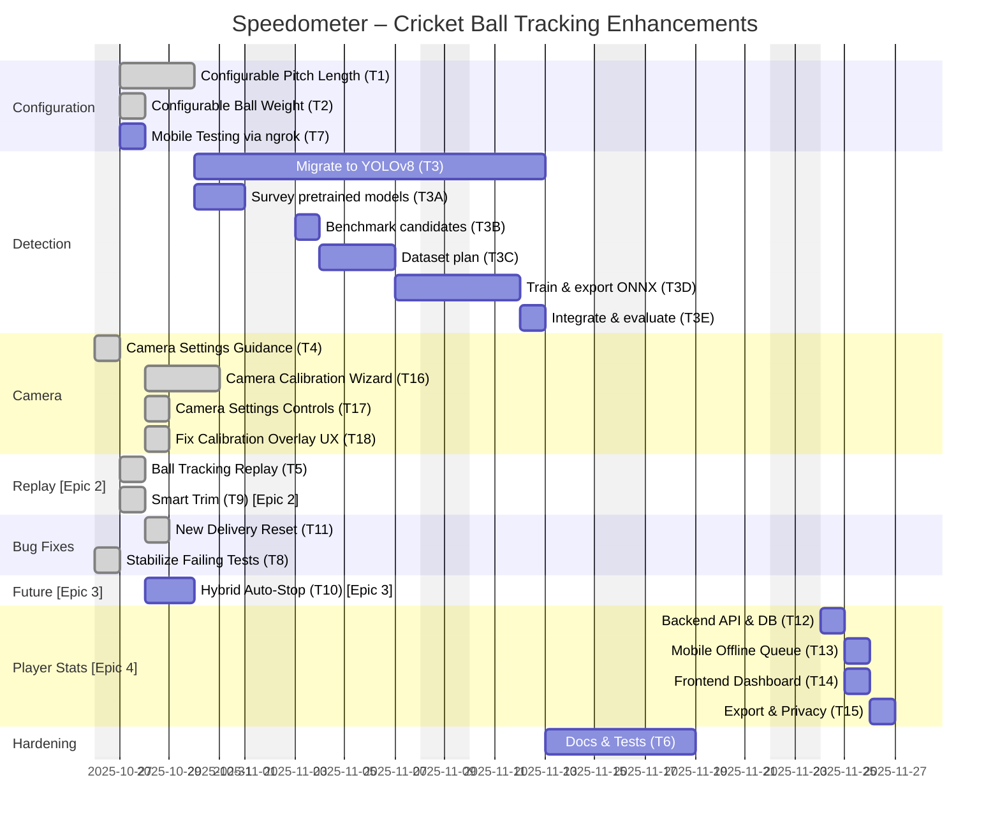

# Speedometer – Project Plan (JSON + Gantt)

This document includes a canonical JSON plan and a visual Gantt chart for the cricket ball tracking enhancements.

## Epics

### Epic 2: Ball Tracking Recording & Replay User Flow

- **GitHub Issue:** [#10](https://github.com/vikraman2212/sports-analyst/issues/10)
- **Status:** ✅ Complete (T5, T9, T11 finished)
- **Scope:** Complete user flow from camera setup → recording → analysis → replay → export
- **Related Tasks:** ✅ T5 (Ball Tracking Replay), ✅ T9 (Smart Trim), ✅ T11 (New Delivery Reset)
- **Key Deliverables:**
  - ✅ Mermaid user flow diagram (recording states, decision points, error handling)
  - ✅ Hawk-Eye style trajectory replay visualization
  - ✅ Smart trim: auto-detect ball appearance/disappearance
  - ✅ Timeline UI showing full recording with relevant portion highlighted
  - ✅ Export options (screenshot, video, JSON)
  - ✅ New Delivery button properly resets camera state
- **Documentation:**
  - `docs/trajectory-only-replay-analysis.md` - Architecture analysis
  - `docs/replay-trajectory-only-mockup.html` - Interactive visual mockup
  - `docs/TASK_5_DECISION.md` - Final decision and implementation plan
- **Completion:**
  - T5 completed 2025-10-27 (commit 00bd8e3)
  - T9 completed 2025-10-27 (commit a599490)
  - T11 completed 2025-10-28 (commit 62a23b8)
  - All acceptance criteria met, 588/588 tests passing

### Epic 4: Player Statistics & Progress

- **GitHub Issue:** TBD (to be created)
- **Status:** Planned (Future Release)
- **Architecture:** Mobile-first with server-side DB + localStorage queue
- **Scope:** Track deliveries over time, view trends, export data
- **Related Tasks:** T12 (Backend API), T13 (Offline Queue), T14 (Dashboard), T15 (Export)
- **Key Deliverables:**
  - Backend: FastAPI + SQLite/PostgreSQL with device key auth
  - Offline queue: localStorage for 20-30 deliveries
  - Stats UI: Recharts with speed trends, histograms, session history
  - Export: CSV/JSON for data portability
  - Privacy: Local-first, no PII, user owns data
- **Architecture Decision:**
  - ✅ Server-side DB (not IndexedDB) - multi-device access, lighter frontend
  - ✅ localStorage queue for offline - simple, 21KB for 30 deliveries
  - ✅ Mobile-first - laptops lack cameras for recording
  - ✅ Desktop viewer optional (Phase 2) - QR login, read-only
- **Documentation:**
  - `docs/player-stats-architecture.md` - Full architecture + decisions
  - `docs/player-stats-mockup.html` - Interactive UI mockup
- **Confidence:** 95% (revised from IndexedDB to server-first approach)

### Epic 5: Camera Calibration & Settings

- **GitHub Issue:** [#30](https://github.com/vikraman2212/sports-analyst/issues/30), [#31](https://github.com/vikraman2212/sports-analyst/issues/31), [#32](https://github.com/vikraman2212/sports-analyst/issues/32)
- **Status:** ✅ Complete (T16, T17, T18 finished)
- **Scope:** Interactive camera calibration wizard and settings controls
- **Related Tasks:** ✅ T16 (Calibration Wizard), ✅ T17 (Settings Controls), ✅ T18 (UX Fixes)
- **Key Deliverables:**
  - ✅ Interactive two-point calibration overlay (touch/mouse)
  - ✅ Camera settings panel (FPS, resolution, exposure, ISO, shutter)
  - ✅ Progressive fallback strategy for camera constraints (3-level: exact → ideal → minimal)
  - ✅ Calibration profile persistence (localStorage)
  - ✅ CalibrationStatusBadge shows current setup
  - ✅ Mobile-responsive with proper z-index layering
  - ✅ **BREAKTHROUGH:** Discovered Pixel 9 Pro supports 60 FPS (was hardcoded at 30)
- **Documentation:**
  - `docs/T16_Quick_Reference.md` - Calibration wizard guide
  - `docs/T16_Camera_Calibration_Quick_Reference.md` - Quick reference
  - `docs/T16_COMPLETION_SUMMARY.md` - Implementation summary
  - `docs/camera-fps-strategy.md` - Progressive fallback strategy
  - `docs/T17_CAMERA_SETTINGS_SUMMARY.md` - Settings implementation
- **Completion:**
  - T16 completed 2025-10-28 (commit 76f75db) - Calibration wizard with profile management
  - T17 completed 2025-10-28 (commit a94b2c1) - FPS/resolution controls with 60 FPS support
  - T18 completed 2025-10-28 (commit c8f4e89) - UX fixes for overlay interference
  - All acceptance criteria met, 610/610 tests passing
- **Impact:** Users can now get 60 FPS on high-end devices, dramatically improving ball tracking accuracy

---

## JSON Plan

See `docs/project-plan.json` for the machine-readable plan used to drive tasks, timelines, dependencies, and risks.

## Gantt (Mermaid)

## Notes

- Start date: 2025-10-27. Target completion: ✅ 2025-10-28 (Epic 2 & 5 COMPLETE) / 2025-11-27 (Epic 4 MVP)
- **Completed (Phase 1):**
  - ✅ T1 (Pitch Length) - Configurable pitch with 3 presets
  - ✅ T2 (Ball Weight) - Mass-aware smoothing & warnings
  - ✅ T4 (Camera Diagnostics) - FPS inference, exposure detection
  - ✅ T5 (Replay) - Hawk-Eye visualization, trajectory-only approach
  - ✅ T7 (Mobile Testing) - ngrok HTTPS tunnel setup
  - ✅ T8 (Test Stabilization) - All 610 tests passing
  - ✅ T9 (Smart Trim) - Detection-based frame trimming
  - ✅ T11 (New Delivery Reset) - Fixed camera state reset bug
  - ✅ T16 (Calibration Wizard) - Interactive two-point calibration
  - ✅ T17 (Camera Settings) - FPS/resolution controls with 60 FPS support
  - ✅ T18 (UX Fixes) - Overlay z-index and interaction fixes
- **🎯 Next Up:** T10 - Hybrid Auto-Stop (auto-detect ball exit, 2d implementation)
- **Epic 4 Revised:** Mobile-first architecture with server-side DB (reduced from 7d to 3d estimate)
- T1 and T2 ran in parallel. T4 completed ahead of schedule (1d vs 6d planned).
- **✅ T5 (Epic 2):** Completed in 1d (trajectory-only approach, no video buffer complexity)
- **✅ T9 (Epic 2):** Completed in 4 hours (smart trim with detection-based frame trimming)
- **✅ T11 (Epic 2):** Completed in 1 hour (resetTrigger prop pattern)
- **✅ T16-18 (Epic 5):** Camera calibration system completed in 3 days total
- **🚀 T17 Breakthrough:** Discovered Pixel 9 Pro supports 60 FPS (was hardcoded at 30)
- **T10 (Epic 3):** Ready to start - Hybrid auto-stop for automated recording (2d implementation)
- T5 and T9 ran in parallel without T3 dependency (using mock detector for now).
- See JSON for acceptance criteria, deliverables, and likely touchpoints in the codebase.

## Epic Links

- [Epic 2: Ball Tracking Recording & Replay User Flow](https://github.com/vikraman2212/sports-analyst/issues/10) - T5, T9
- [Task 9: Smart Trim - Auto-detect Recording Start/Stop](https://github.com/vikraman2212/sports-analyst/issues/11) - Epic 2
- [Task 10: Hybrid Auto-Stop - Detect Ball Exit Automatically](https://github.com/vikraman2212/sports-analyst/issues/12) - Epic 3 (Future)

## Reference Links

- **Ball Tracking Article:** [Analytics Vidhya - Ball Tracking Cricket Computer Vision](https://www.analyticsvidhya.com/blog/2020/03/ball-tracking-cricket-computer-vision/)
  - Context for "Automatic Target Aimer" (defense use case) → auto-ROI detection in cricket context
  - Reference for object detection and tracking approaches
