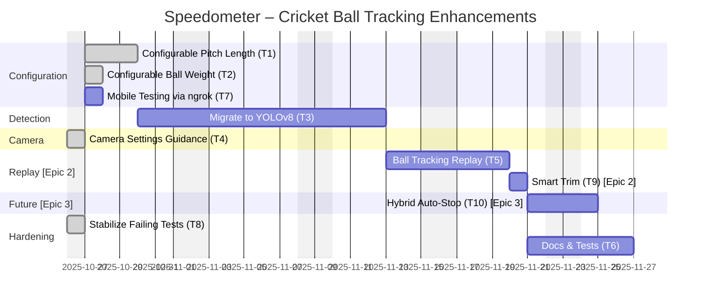

# Speedometer – Project Plan (JSON + Gantt)

This document includes a canonical JSON plan and a visual Gantt chart for the cricket ball tracking enhancements.

## Epics

### Epic 2: Ball Tracking Recording & Replay User Flow

- **GitHub Issue:** [#10](https://github.com/vikraman2212/sports-analyst/issues/10)
- **Status:** In Planning
- **Scope:** Complete user flow from camera setup → recording → analysis → replay → export
- **Related Tasks:** T5 (Ball Tracking Replay), T9 (Smart Trim)
- **Key Deliverables:**
  - Mermaid user flow diagram (recording states, decision points, error handling)
  - Hawk-Eye style trajectory replay visualization
  - Smart trim: auto-detect ball appearance/disappearance
  - Timeline UI showing full recording with relevant portion highlighted
  - Export options (screenshot, video, JSON)
- **Documentation:**
  - `docs/trajectory-only-replay-analysis.md` - Architecture analysis
  - `docs/replay-trajectory-only-mockup.html` - Interactive visual mockup
  - `docs/TASK_5_DECISION.md` - Final decision and implementation plan

### Epic 3: Future Enhancements

- **GitHub Issue:** TBD
- **Status:** Planned (Future Release)
- **Scope:** Advanced automation features for improved user experience
- **Related Tasks:** T10 (Hybrid Auto-Stop)
- **Key Deliverables:**
  - Automatic STOP detection (ball exits frame)
  - Configurable auto-stop thresholds (Quick/Normal/Patient)
  - Countdown UI with progress indicators
  - Path toward fully automatic detection (Epic 4)
- **Future Vision:**
  - Epic 4: Fully automatic START + STOP (motion detection)
  - Multi-delivery session recording
  - Smart batsman detection for ROI

---

## JSON Plan

See `docs/project-plan.json` for the machine-readable plan used to drive tasks, timelines, dependencies, and risks.

## Gantt (Mermaid)

## Notes

- Start date: 2025-10-27. Target completion: 2025-11-21 (Epic 2) / 2025-11-24 (Epic 3)
- **Completed:** T1 (Pitch Length), T2 (Ball Weight), T4 (Camera Diagnostics), T8 (Test Stabilization)
- T1 and T2 ran in parallel. T4 completed ahead of schedule (1d vs 6d planned).
- **T5 (Epic 2):** Reduced from 7d to 5d due to trajectory-only approach (no video buffer complexity)
- **T9 (Epic 2):** Smart trim auto-detects ball appearance/disappearance (1d implementation)
- **T10 (Epic 3):** Hybrid auto-stop for future release (2d implementation)
- T5 depends on T3. T9 depends on T3 and T5. T10 depends on T9.
- See JSON for acceptance criteria, deliverables, and likely touchpoints in the codebase.

## Epic Links

- [Epic 2: Ball Tracking Recording & Replay User Flow](https://github.com/vikraman2212/sports-analyst/issues/10) - T5, T9
- [Task 9: Smart Trim - Auto-detect Recording Start/Stop](https://github.com/vikraman2212/sports-analyst/issues/11) - Epic 2
- [Task 10: Hybrid Auto-Stop - Detect Ball Exit Automatically](https://github.com/vikraman2212/sports-analyst/issues/12) - Epic 3 (Future)

## Reference Links

- **Ball Tracking Article:** [Analytics Vidhya - Ball Tracking Cricket Computer Vision](https://www.analyticsvidhya.com/blog/2020/03/ball-tracking-cricket-computer-vision/)
  - Context for "Automatic Target Aimer" (defense use case) → auto-ROI detection in cricket context
  - Reference for object detection and tracking approaches
