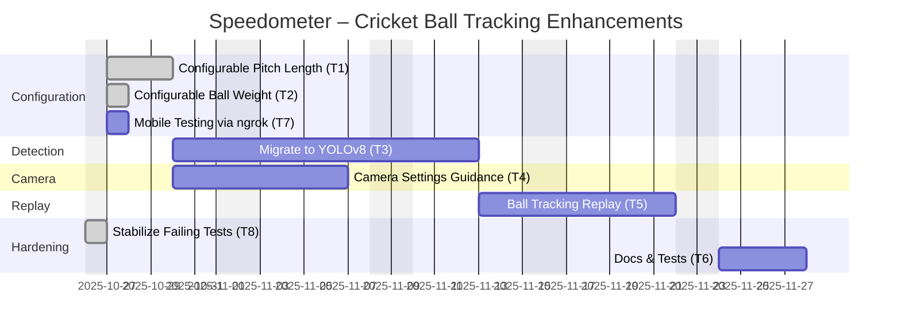

# Speedometer – Project Plan (JSON + Gantt)

This document includes a canonical JSON plan and a visual Gantt chart for the cricket ball tracking enhancements.

## JSON Plan

See `docs/project-plan.json` for the machine-readable plan used to drive tasks, timelines, dependencies, and risks.

## Gantt (Mermaid)

## Notes

- Start date: 2025-10-27. Target completion: 2025-11-21.
- T1 and T2 can run in parallel. T4 begins after T1. T5 depends on T3. T6 depends on all prior tasks.
- See JSON for acceptance criteria, deliverables, and likely touchpoints in the codebase.
